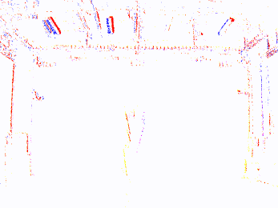
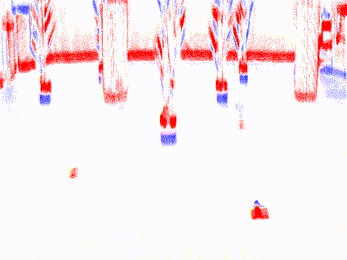
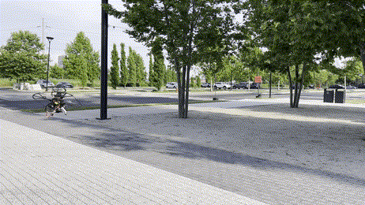
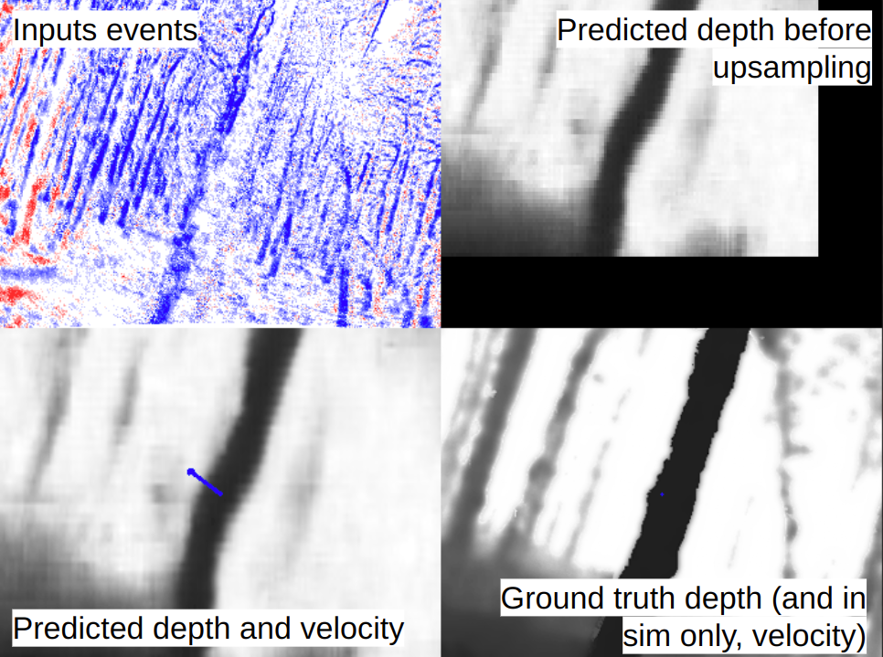

# Monocular Event-Based Vision for Obstacle Avoidance with a Quadrotor

**Updates:**
- *December 2024:* Open-source code released for (still work in progress -- relevant simulation submodule updates being provided soon) simulation rollouts and data collection, real data collection, events+depth calibration, training models, and real deployment. Note that file paths and other parameters in various scripts may have to be manually adjusted by the user, and code is provided as-is.

[Project page](https://www.anishbhattacharya.com/research/evfly)  &nbsp;
[Paper](https://openreview.net/pdf?id=82bpTugrMt)  &nbsp;
[Video](https://www.youtube.com/watch?v=NI513KE9DYo)

<!-- Table of contents with links to each section -->
## Table of Contents
- [Introduction](#introduction)
  <!-- - [GIFs](#gifs) -->
- [Simulator installation](#simulator-installation)
  <!-- - [(optional) Set up a catkin workspace](#optional-set-up-a-catkin-workspace)
  - [Clone this repository and set up](#clone-this-repository-and-set-up)
  - [Test (simulation)](#test-simulation) -->
- [Dataset generation (simulation)](#dataset-generation-simulation)
  <!-- - [1. Run expert rollouts and collect data](#1-run-expert-rollouts-and-collect-data)
  - [2. Run Vid2E to convert images to events](#2-run-vid2e-to-convert-images-to-events)
  - [3. (optional) Package data into h5 files](#3-optional-package-data-into-h5-files) -->
- [Dataset generation (real-world)](#dataset-generation-real-world)
  <!-- - [1. Calibrate event camera and depth camera](#1-calibrate-event-camera-and-depth-camera)
  - [2. Gather in-situ depth images and events](#2-gather-in-situ-depth-images-and-events)
  - [3. Align and package data](#3-align-and-package-data) -->
- [Train](#train)
  <!-- - [Download a dataset](#download-a-dataset)
  - [Train a model](#train-a-model) -->
- [Real-world deployment](#real-world-deployment)
- [Citation](#citation)
- [Acknowledgements](#acknowledgements)

## Introduction

This is the official repository for the paper "Monocular Event-Based Vision for Obstacle Avoidance with a Quadrotor" by Bhattacharya, et al. (2024) from [GRASP, Penn](https://www.grasp.upenn.edu) and [RPG, UZH](https://rpg.ifi.uzh.ch/). Please note that this repository contains research-grade code and a typical user may come across some legacy and messy code.

We present the first static-obstacle avoidance method for quadrotors using just an onboard, monocular event camera. Quadrotors are capable of fast and agile flight in cluttered environments when piloted manually, but vision-based autonomous flight in unknown environments is difficult in part due to the sensor limitations of traditional onboard cameras. Event cameras, however, promise nearly zero motion blur and high dynamic range, but produce a large volume of events under significant ego-motion and further lack a continuous-time sensor model in simulation, making direct sim-to-real transfer not possible.

By leveraging depth prediction as a pretext task in our learning framework, we can pre-train a reactive obstacle avoidance events-to-control policy with approximated, simulated events and then fine-tune the perception component with limited events-and-depth real-world data to achieve obstacle avoidance in indoor and outdoor settings.

We demonstrate this across two quadrotor-event camera platforms in multiple settings and find, contrary to traditional vision-based works, that low speeds (1m/s) make the task harder and more prone to collisions, while high speeds (5m/s) result in better event-based depth estimation and avoidance. We also find that success rates in outdoor scenes can be significantly higher than in certain indoor scenes.

<!-- GIFs -->

#### Real demonstrations

We successfully avoid obstacles at speeds of 1-5m/s, indoor and outdoor, in the dark and in the forest.

 

 

 

 

## Simulator installation

Note that if you'd only like to train models, and *not* run the Flightmare simulation to test models in simulation, you can simply clone this repository and skip straight to section [Train](#train).

#### (optional) Set up a catkin workspace

If you'd like to start a *new* catkin workspace, then a typical workflow is (note that this code has only been tested with ROS Noetic and Ubuntu 20.04):
```
cd
mkdir -p evfly_ws/src
cd evfly_ws
catkin init
catkin config --extend /opt/ros/$ROS_DISTRO
catkin config --merge-devel
catkin config --cmake-args -DCMAKE_BUILD_TYPE=Release -DCMAKE_CXX_FLAGS=-fdiagnostics-color
```

#### Clone this repository and set up

Once inside your desired workspace, clone this repository:
```
cd ~/evfly_ws/src
git clone git@github.com:anish-bhattacharya/evfly
cd evfly
```

In order to replicate the Unity obstacle environment used for training and (sim) testing, you will need to download `simulation/custom_sim_forest_environment.tar` (5.5MB) from [Datashare](https://upenn.app.box.com/v/evfly-grasp-rpg) and extract it to the right location (below). This contains 100 tree obstacle configurations.
```
tar -xvf <path/to/custom_sim_forest_environment.tar> -C flightmare/flightpy/configs/vision
```

You will also need to download our Unity resources and binaries. Download `simulation/flightrender.tar` (443MB) from [Datashare](https://upenn.app.box.com/v/evfly-grasp-rpg) and then:
```
tar -xvf <path/to/flightrender.tar> -C flightmare/flightrender
```

Then, install the dependencies via a given script:
```
bash setup_ros.bash
cd ../..
catkin build
source devel/setup.bash
cd src/evfly
```

## Test (simulation)

As we describe in the paper, testing the model in real-time simulation necessitates estimating eventstreams via difference-of-log-images, which is out-of-distribution for the Vid2E-trained models. Therefore, do not expect high success rates in simulation test runs.

#### Download pretrained weights

Download `pretrained_models.tar` (50MB) from [Datashare](https://upenn.app.box.com/v/evfly-grasp-rpg). This tarball includes a number of simulation-pre-trained and real-fine-tuned models. For simulation testing in the provided forest environment, we will use the jointly-trained $D(\theta),V(\phi)$ model `sim_forest_DthetaVphi.pth`.
```
tar -xvf <path/to/pretrained_models.tar> -C models
```

#### Edit the config file

*If you are just interested in the same forest environment we use in the paper, you should not need to edit the config file.*

Relevant notes for the `flightmare/flightpy/configs/vision/config.yaml` file:
- `level` specifies the environment type (we only provide `sim_forest_environment`) and `env_folder` specifies the environment index (`environment_<0-99>`).
- `datagen: 0` and `rollout: 1` runs trials in sequential environment indices starting from the given `env_folder`, and uses the `custom_` environment formulation we provide be pre-pending `custom_` to the specified `level`. This custom environment formulation describes static obstacles as dynamic ones so they can have updated positions every time the Unity environment is reset.
- `unity: scene: 2` specifies the warehouse environment with grassy ground texture and improved lighting on the trees. Other available scenes and their drone starting positions are found in `flightmare/flightpy/configs/scene.yaml`.

When running the simulation (the following section), you can set any number `N` of trials to run. To run trials on the same, specified environment index, set `datagen: 1` and `rollout: 0`.

#### Run the simulation

The `launch_evaluation.bash` script launches Flightmare and the trained model for depth-based flight when using `vision` mode. To run trials:
```
bash launch_evaluation.bash <N> vision
```

Some details: If you look at the bash script, you'll see multiple python scripts being run. `envtest/ros/evaluation_node.py` counts crashes, starts and aborts trials, and prints other statistics to the console. `envtest/ros/run_competition.py` subscribes to input depth images and passes them to the corresponding functions (located in `envtest/ros/user_code.py`) that run the model and return desired velocity commands. The topic `/debug_img1` streams a depth image with an overlaid velocity vector arrow which indicates the model's output velocity command.

## Dataset generation (simulation)

To create a dataset of events, depth images, and desired velocity commands from execution of the privileged expert in simulation, we must first collect data from expert rollouts, then convert collected images into approximated events, and finally package the data into h5 file formats that our training script can read.

#### 1. Run expert rollouts and collect data

Ensure that the `flightmare/flightpy/configs/vision/config.yaml` parameters are unchanged. Default evaluation parameters specified in `envtest/ros/evaluation_config.yaml` resets the environment once the drone reaches the target `x=60`, the drone exits a specified bounding box, or the trial times out.

Run Flightmare in `state` mode to activate the privileged expert policy. Data will be stored upon each rollout in `envtest/ros/train_set`:
```
mkdir -p envtest/ros/train_set
bash launch_evaluation.bash <N> state
```

After populating the `train_set` directory, you can move the relevant trajectory folders to your desired dataset directory:
```
mv envtest/ros/train_set/* data/datasets/new_dataset/
```

#### 2. Run Vid2E to convert images to events

Install [Vid2E](https://github.com/uzh-rpg/rpg_vid2e) then run the following script to approximate events from the collected images. A numpy object array `evs_frames.npy` is created that contains a sequence of event frames for each trajectory in the dataset. Each event frame is a float array for all events within the time window between consecutive image frames, and contains the sum of positive and negative events at a given pixel location multiplied by the corresponding contrast thresholds (defaults values are +/-0.2).

```
python utils/to_events.py --dataset data/datasets/new_dataset --output_path data/datasets/new_dataset --acc_scheme time --keep_collisions
```

#### 3. (optional) Package data into h5 files

Our dataloader can read data from the format of trajectory folders+events npy file, but dataloading is faster when data is packaged into h5 files. To do this, run the following script to create a `new_dataset.h5` file that contains the events, depth images, and telemetry data for each trajectory in the dataset.
```
python utils/to_h5.py new_dataset convert False
```

## Dataset generation (real-world)

The post-training phase that fine-tunes the $D(\theta)$ model with real-world event camera data relies on a calibrated event camera-depth camera pair. We provide scripts to collect data, time-synchronize event batches with depth images, align them, and form a dataset.

#### 1. Calibrate event camera and depth camera

In our work, we use a Intel Realsense D435 depth camera with either a Prophesee Gen3 or DAVIS 346 event camera. The D435 depth images are pre-aligned with the infrared1 camera feed, which we can therefore use for calibration. In order to calibrate to the event camera, we use the e2calib procedure, including conversion of events to approximated grayscale images. Note that we utilize ROS1, e2vid, and Kalibr for the calibration process.

Record a chessboard sequence via `rosbag record` with the D435 and the event camera, recording the infrared1 feed and events. We recommend holding the dual-camera setup still and moving the chessboard in front of it. Due to the events->images step later, you must start recording data with the board fully covering the event camera field of view then slowly back up and move the board around for collection.
- D435: Ensure that you are recording the D435 infrared images by setting the argument `enable_infra` to true in its launch file. When you use librealsense and ROS1 to run the camera you should see that `/camera/infra1/image_rect_raw` is aligned to `/camera/depth/image_rect_raw`.
- Event camera: Make sure that your event camera is focused properly and also publishing an eventstream. In our experience, the DAVIS ROS1 packages [dv-ros](https://gitlab.com/inivation/dv/dv-ros) or [rpg_dvs_ros](https://github.com/uzh-rpg/rpg_dvs_ros) or Prophesee Metavision ROS1 package [by Bernd Pfrommer](https://github.com/ros-event-camera/metavision_driver) were fast enough to perform approximate time-synchronization with the D435. With the [Prophesee-provided package](https://github.com/prophesee-ai/prophesee_ros_wrapper) we observed a small lag making it unusable for calibration. Note that if using a non-DVS rosmsg type, you might have to convert your event camera data in the rosbag to use the DVS message format first using this script: `data_gather/rosbag_metavision-ros-driver_to_DVSmsgs.py`.

Next, we need to extract the infrared image timestamps, convert the events data to h5 format, run image reconstruction from the events, and finally calibrate the two image feeds. We provide the script `data_gather/process_calib.sh` to run these steps. Adjust the paths in the script as necessary. You will need to install these notable dependencies:
- e2calib, install via the steps under [e2calib: Image Reconstruction](https://github.com/uzh-rpg/e2calib/tree/main?tab=readme-ov-file#image-reconstruction);
- [Kalibr multi-camera calibration](https://github.com/ethz-asl/kalibr/wiki/multiple-camera-calibration).

Then you can run our script:
```
bash data_gather/process_calib.sh /path/to/calibration/rosbag <optional_GPU_ID>
```
At the end of the script, the kalibr docker container will be launched, and you should run the following commands. This may take some time. If all goes well, calibration will be successful and txt, yaml, and pdf files will be generated with both cameras' parameters.
```
source devel/setup.bash
rosrun kalibr kalibr_calibrate_cameras \
    --bag /data/rosbag.bag --target /data/chessboard.yaml \
    --models pinhole-radtan pinhole-radtan \
    --topics /cam0/image_raw /cam1/image_raw
```

#### 2. Gather in-situ depth images and events

Now we may gather depth and events to fine-tune the $D(\theta)$ model. `data_gather` is a ROS1 package useful for data collection, which must be built:
```
cd /path/to/evfly_ws
catkin build data_gather
source devel/setup.bash
```
Launch the following to run nodes for an event camera and a D435 camera:
```
roslaunch data_gather events_and_d435.launch
```
Once both cameras are running, start the bagging script to collect the necessary data:
```
bash data_gather/bag_evs_d435.sh
```
We recommend gathering around a minute of handheld data with a variety of motions (rolling/pitching/forward/backward/left/right/fast/slow).

#### 3. Align and package data

Depending on the size of your rosbag file, you may want to splice the rosbag into smaller parts, which can then be treated as trajectories during the training process. We provide the following script to create smaller rosbags of length 10s each:
```
python data_gather/splice_rosbag.py /path/to/large/rosbag.bag /path/to/spliced/rosbags <rosbag length in seconds>
```
Next, run this bash script to extract data from each rosbag in a directory:
```
bash data_gather/data_from_rosbags.sh /path/to/spliced/rosbags data/datasets/new_dataset
```
Finally, run this script to run the necessary post-processing steps to align the events and depth images, and package the data into an h5 file. As in some previous scripts, you will need to adjust paths as necessary.
```
bash data_gather/prep-dataset.sh new_dataset
```
Now you should be able to use this h5 dataset file for training.

## Train

#### (optional) Download a dataset

We provide datasets for the simulated forest environment and the real forest environment presented in the paper. The corresponding h5 dataset files can be downloaded from the [Datashare](https://upenn.box.com/v/evfly-grasp-rpg) in the folder `datasets`. Please read the README for details on the provided datasets and the data format.

#### Train a model

We provide a script `learner.py` that instantiates a Learner class, which can be used for loading models and datasets for purposes like model evaluation and data analysis, as well as training a new or pre-trained model. Training configuration is specified in the arguments in `learner/configs/config.txt`. Relevant files for debugging, as well as model checkpoints and tensorboard files are saved in the `learner/logs` directory. Note that we have only confirmed training functionality with a Nvidia GPU. To train:
```
python learner/learner.py --config learner/configs/config.txt
```

You can monitor training and validation statistics with Tensorboard:
```
tensorboard --logdir learner/logs
```

Please refer to the code to understand what each argument in the config file does. Some argument descriptions are in the later section "Useful config details for training or testing".

#### Evaluate a model

You can evaluate a model's performance for both depth prediction and velocity command prediction using the provided script `learner/evaluation_tools.py`. This script generates plots to compare ground truth vs. predicted velocity commands (valid for simulation only, where we have expert velocity commands) and a gif visualization of input events, predicted depth and velocity commands, and ground truth. These plots or visualizations are saved in the evaluation's workspace, saved in the `learner/logs` directory.

Sample snapshot from the gif visualization:



We provide sample commands with config files that assume pretrained models have been placed in the `evfly/data` directory.
For testing the joint $D(\theta)$-and-$V(\phi)$ model on the simulated forest dataset:
```
python learner/evaluation_tools.py --config learner/configs/eval_config_joint.txt
```
For testing the real forest deployment model that uses a ViT-LSTM model from [another work](https://github.com/anish-bhattacharya/ViT-for-quadrotor-obstacle-avoidance) for $V(\phi)$:
```
python learner/evaluation_tools.py --config learner/configs/eval_config_origunet_w_vitlstm.txt
```

#### Useful details for training or testing

- You can train on multiple datasets by listing them in the dataset argument: `dataset = [real_forest-a, real_forest-b, real_forest-c, real_forest-d, real_forest-e]`.
- `evs_min_cutoff` specifies the bottom percentage threshold of events to cut out from event frames prior to feeding to the model. This helps cut out some of the high-texture events in real world trials, such as grass texture. For simulation datasets we keep this at 0 but for real datasets we typically set it to 0.15 (15%). You should not have to tune this parameter.
- `short=<N>` can be used to shorten the dataset size, typically for debugging purposes. Note that if you use small values like `short=5` then the `val_split=0.15` might lead to fewer than 2 validation trajectories, leading to errors in evaluation.
- To train or test a model from a given checkpoint, specify the path in the `checkpoint_path` argument in the config file.
- If you are training a model from a given checkpoint on the same dataset, and want to preserve the same train/val split, set `load_trainval = True`.
- During training, the argument `loss_weights = [10.0, 1.0]` specifies that the first loss parameter (velocity supervision MSE loss) is up-weighted by a factor of 10.0 and the second loss parameter (depth supervision MSE loss) is weighted by 1.0.
- During training, the argument `optional_loss_param = [5.0, -1.0]` specifically up-weights velocity prediction loss further by 5.0 where ground truth is executing a dodging maneuver (y- or z- command nonzero) and scales the depth prediction loss by the inverse depth values to up-weight the loss for closer objects.
- Note that the evaluation gif for a training example (with default parameters, one training and two validation gifs are generated) might exhibit data augmentation artifacts, like being left-right flipped.

## Real-world deployment

We provide a ROS1 package `evfly_ros` for running the trained models on an incoming event camera stream. This package does not provide an autopilot or flight controller, and is meant to be used in conjunction with a broader autonomy architecture (see [KumarRobotics Autonomous Flight](https://github.com/KumarRobotics/kr_autonomous_flight), [RPG Agilicious](https://github.com/uzh-rpg/agilicious), [PX4](https://github.com/px4/px4-autopilot/), [Betaflight](https://github.com/betaflight/betaflight)) In the `run.py` script, you should modify the paths `EVFLY_PATH` and `CALIB_FILE`. Additionally, you need to modify the ROS topic names in the subscribers and publishers as appropriate. On a 12-core, 16GB RAM, cpu-only machine (similar to that used for hardware experiments presented in the paper) the model `OrigUNet_w_VITFLY_ViTLSTM` runs a forward pass in approximately 73ms.

Run your event camera driver, our C++ events processing node, and the model inference node with:
```
roslaunch evfly_ros evs_proc.launch
```
But if you are using DVS cameras, our C++ events processing node, and the model inference node with:
```
roslaunch evfly_dv_ros dvs.launch
```

Model predicted depth and velocities, as well as the input events packaged into a frame, are published on the `/output` topics.

We include a `/trigger` signal that, when continuously published to, will route the predicted velocity commands to a given topic `/robot/cmd_vel`. We do this with the following terminal command typically sent from a basestation computer. If you Ctl+C this command, the rosnode will send velocity 0.0 commands to stop in place. This is a safety feature.
```
rostopic pub -r 50 /trigger std_msgs/Empty "{}"
```

Some details:
- Keep in mind the model is trained to continuously fly forward at the desired velocity and requires either manual pilot takeover  or reaching the positional guard limit to stop.
- z-velocity commands are currently set to maintain a given desired height set by `self.des_z`, and the p-gain used to do this may need slight tuning (line 306).
- We use a ramp-up in the `run()` function to smoothly accelerate the drone to the desired velocity over `self.ramp_duration` seconds.
- If you are using an event camera with resolution different than 260x346, then depending on the lens used for the event camera in relation to the depth camera intrinsics, you may want to either center-crop or just resize the batch of events to 260x346. This option is on lines 345-351.
- Velocity commands are published with respect to x-direction forward, y-direction left, and z-direction up.

Please fly safely!

## Citation

```
@inproceedings{bhattacharya2024monocular,
  title={Monocular Event-Based Vision for Obstacle Avoidance with a Quadrotor},
  author={Bhattacharya, Anish and Cannici, Marco and Rao, Nishanth and Tao, Yuezhan and Kumar, Vijay and Matni, Nikolai and Scaramuzza, Davide},
  booktitle={8th Annual Conference on Robot Learning}
}
```

If you use the privileged expert, pretrained $V(\phi)$ model `sim_vitfly-vitlstm_Vphi.pth`, or code in `learner/vitfly_models.py` for your work, please additionally cite the original paper:
```
@article{bhattacharya2024vision,
  title={Vision Transformers for End-to-End Vision-Based Quadrotor Obstacle Avoidance},
  author={Bhattacharya, Anish and Rao, Nishanth and Parikh, Dhruv and Kunapuli, Pratik and Wu, Yuwei and Tao, Yuezhan and Matni, Nikolai and Kumar, Vijay},
  journal={arXiv preprint arXiv:2405.10391},
  year={2024}
}
```

## Acknowledgements

Some parts of the training or testing scripts, the privileged expert policy, the ViT-LSTM model for velocity command prediction, and other code snippets may be adapted from the project [Vision Transformers for End-to-End Vision-Based Quadrotor Obstacle Avoidance](https://github.com/anish-bhattacharya/ViT-for-quadrotor-obstacle-avoidance).

Simulation launching code and the versions of `flightmare` and `dodgedrone_simulation` are from the [ICRA 2022 DodgeDrone Competition code](https://github.com/uzh-rpg/agile_flight).
